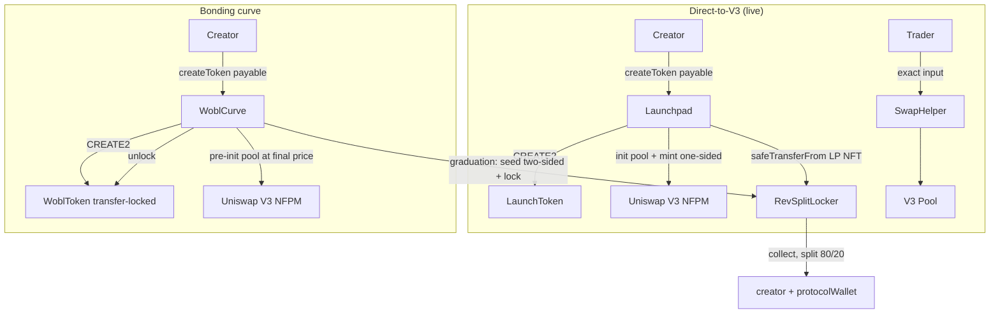

# wobl.fun contracts: audit scope and specification

wobl.fun is a permissionless memecoin launchpad on Robinhood Chain (Arbitrum Orbit L2, mainnet
chainId 4663, testnet 46630). This document is the pre-kickoff read: scope, architecture,
invariants, access control, threat model, and known issues. Where this document and the source
disagree, the source is authoritative.

Functions are referenced by name rather than line number throughout, so the references stay valid
as the source moves.

- **Commit:** tag `audit-v1` (see "Freezing" below)
- **Solidity:** `Launchpad`, `RevSplitLocker` and `SwapHelper` float on `^0.8.20`; `WoblCurve` is
  pinned to `0.8.36`
- **Total in scope:** 1,581 lines across 4 files

---

## 1. Scope

| Contract | File | Lines | Status |
|---|---|---|---|
| `Launchpad` (+ `LaunchToken`) | `contracts/Launchpad.sol` | 416 | Live on mainnet |
| `RevSplitLocker` | `contracts/RevSplitLocker.sol` | 129 | Live on mainnet, shared by both launch paths |
| `SwapHelper` | `contracts/SwapHelper.sol` | 149 | Live on mainnet |
| `WoblCurve` (+ `WoblToken` + `WMath`) | `contracts/WoblCurve.sol` | 887 | Live on mainnet, not yet reachable from the frontend |

**Out of scope:** Uniswap V3 core/periphery (NFPM, factory, pool, SwapRouter02), WETH9, Multicall3,
the frontend, and all off-chain tooling.

**Not included in this bundle, available on request:** the solc-js build script (`lib/compile.js`),
the on-chain e2e scripts (`e2e-test.js`, `curve-e2e-test.js`), and the deployment JSON files that
Section 6 quotes addresses from.

**Off-chain dependency worth knowing about:** a 389-line BigInt port of Uniswap V3 TickMath computes
`sqrtPriceX96`, `tickLower` and `tickUpper` for the one-sided launch seed *before* the transaction,
and passes them into `Launchpad.createToken` as `CreateParams`. A bug there produces a mispriced or
reverting seed, but cannot mint liquidity outside what the on-chain guards allow: the WETH-side
desired amount is hardwired to 0 and `liquidity == 0` reverts on-chain. `WoblCurve` computes its
graduation price entirely on-chain in `WMath` and does not depend on it.

---

## 2. Architecture

Two independent launch paths share one fee-splitting LP locker.

### 2.1 Direct-to-V3 (live)

`Launchpad.createToken()` deploys a fixed-supply ERC20 (`LaunchToken`, CREATE2-predictable), seeds
100% of supply as a **one-sided** Uniswap V3 position at a low starting price (the creator supplies
no ETH for liquidity), and locks the LP NFT forever in `RevSplitLocker`. An optional atomic dev-buy
swaps `msg.value` into the fresh pool for the creator. There is no bonding curve and no graduation:
trading is live from block one.

Sequence in `createToken` / `_seedAndLock` / `_devBuy` / `_refund`:

1. Validate `supplyWhole` in `(0, 1e15]`.
2. CREATE2-deploy `LaunchToken` with `fullSalt = keccak256(msg.sender, p.salt)`, so a mempool
   copycat gets a different token address. Entire supply mints to the Launchpad.
3. Compute ordering `memeIsToken0 = token < weth`.
4. `createAndInitializePoolIfNecessary`, assert the pool matches `factory.getPool`, read `slot0`,
   and reject a foreign pre-init price (>~1% sqrt deviation) with `PriceDeviation`.
5. `mint()` one-sided (meme side = full supply, WETH side hardwired to 0). `liquidity == 0` reverts
   `MintFailed`.
6. `safeTransferFrom` the LP NFT to the locker with `abi.encode(msg.sender, token0, token1)`; assert
   `ownerOf == locker` else `LockFailed`.
7. Optional dev buy: wrap `msg.value`, swap exact-input with the caller as recipient. The callback is
   authenticated against the transient `_expectedPool`.
8. `_refund` unwraps residual WETH, returns ETH to the creator, sweeps token dust.

`SwapHelper` is a stateless ETH/token swap router used by the frontend, and required on testnet,
which has no SwapRouter.

### 2.2 Bonding curve (WoblCurve)

`WoblCurve.createToken()` deploys a transfer-locked fixed-supply ERC20 (`WoblToken`) and
pre-initializes its future V3 graduation pool at a deterministic final price (`_graduationSqrtPrice`,
computed purely from immutables). Buyers trade against an `x*y=k` virtual-reserve curve. 80% of
supply sells on the curve; 20% is reserved for the graduation LP.

- `buy` / `sell`: `nonReentrant`, take a `deadline`, quote with `ceilDiv` rounding against the user.
  Strict CEI: all curve storage is committed before any token move or ETH `.call`.
- The last buy fills exactly the remaining `realTokens`, recomputes the ETH kept, and refunds the
  overage. When `realTokens` reaches 0 the same transaction sets `graduated` and calls `_migrate`.
- `_migrate` / `_seedAndLockTwoSided`: set `migrated = true` first, skim the optional migration fee,
  `unlock()` the token, wrap the raised ETH, mint a **two-sided full-range** position (reserved 20% +
  raised ETH) with a 95% amount-min floor (`SEED_MIN_BPS`), and lock the NFT in the same
  `RevSplitLocker`. The creator is read from storage, never `msg.sender`. Leftover WETH goes to the
  protocol, leftover tokens are burned.
- Fees are pull-based: `claimCreatorFees`, `sweepProtocolFees` (permissionless).



---

## 3. Contract specifications

### LaunchToken
Minimal fixed-supply ERC20 minted entirely to the Launchpad at construction. `decimals = 18`.
`contractURI()` implements EIP-7572. Infinite-allowance shortcut on `transferFrom`. No owner, no
mint after construction, no blacklist, no fee-on-transfer, no pause. `_transfer` reverts on
zero-address recipient and insufficient balance.

### Launchpad
Ownerless public factory: create, seed, lock and optional dev-buy in one transaction. Immutables
`nfpm`, `factory`, `weth`, `locker`; registry `allTokens[]` + `launches` mapping; reentrancy guard;
transient swap-callback state `_expectedPool` / `_wethIsToken0`, live only during a dev-buy.
`getTokens(start, count)` clamps to the array length, so over-requesting is safe.
`uniswapV3SwapCallback` is callable only re-entrantly by `_expectedPool`. `receive()` accepts ETH
only from WETH. Trusts the configured NFPM / factory / WETH to be canonical (set at construction,
immutable, zero-address-checked). No owner, no upgrade path, no creation fee.

### RevSplitLocker
Permanent ownerless V3 LP locker with an immutable creator/protocol split. Immutables `nfpm`,
`protocolWallet`, `protocolBps`; constant `MAX_PROTOCOL_BPS = 3000`.

- `onERC721Received` is the only deposit path. Reverts unless `msg.sender == nfpm` (`OnlyNfpm`),
  rejects an already-locked tokenId (`AlreadyLocked`), stores `(creator, token0, token1)`.
- `collect(tokenId)` is **permissionless**. Pulls accrued fees, splits each side
  `protocolBps/10000` to `protocolWallet` and the remainder to the stored creator.

The locker's NFPM interface deliberately declares only `collect`; `transferFrom`,
`decreaseLiquidity`, `burn` and `approve` are absent, so no code path can remove liquidity or move
the NFT. `token0`/`token1` are supplied by the sender rather than read from `positions()`; lying
about them only breaks payout of the liar's own position.

### SwapHelper
Stateless exact-input ETH/token swapper for a single WETH-paired V3 pool. Holds nothing between
calls. `buyExactETH` and `sellExactTokens` enforce `minTokensOut` / `minEthOut` and refund unspent
input on a partial fill in both directions. `uniswapV3SwapCallback` authenticates `msg.sender`
against the canonical `factory.getPool` recomputed from swap `data`, so a fake pool cannot enter it.

### WMath
`ceilDiv`, Babylonian integer `sqrt`, checked casts `toUint128` / `toUint160`, and a 512-bit
`mulDiv` that is a line-for-line port of Uniswap `FullMath.mulDiv`.

### WoblToken
Fixed-supply (1B) ERC20, transfer-locked until graduation. `unlock()` is callable only by the
launchpad, opens transfers forever, and emits `Unlocked()`. `_transfer` reverts `TransfersLocked`
while `!unlocked` unless one side is the launchpad; the mint (`from == 0`) is exempt.

### WoblCurve
The bonding-curve launchpad (Section 2.2). Immutables `nfpm`, `factory`, `weth`, `locker`,
`protocolWallet`, `virtualEthSeed`, `migrationFeeBps`. Constants `SUPPLY_RAW = 1e9 tokens`,
`CURVE_SUPPLY_RAW = 8e8`, `LP_SUPPLY_RAW = 2e8`, `VTOK_SEED = 1_066_666_667e18`,
`TRADE_FEE_BPS = 100`, `PROTOCOL_FEE_SHARE_BPS = 2000`, `SEED_MIN_BPS = 9500`.

External surface: `createToken` (payable, pausable), `buy` (payable), `sell`, `finishGraduation`
(permissionless, idempotent, reachable only in `graduated && !migrated`), `claimCreatorFees`,
`sweepProtocolFees` (permissionless); views `quoteBuy`, `quoteSell`, `currentPrice`, `progressBps`,
`graduationRaise`, `getCurve`, `getTokens`, `predictToken`, `tokenInitCodeHash`; owner-only
`setPaused`, `transferOwnership` (2-step, paired with public `acceptOwnership`), `renounceOwnership`.

`virtualEthSeed` and `migrationFeeBps` are constructor-fixed; the migration fee is hard-capped at
1000 bps.

---

## 4. Invariants

Each names the enforcing mechanism. These back the Foundry suite in `test/`.

### Direct-to-V3

- **INV-1 (protocol fee bounded and immutable).** `RevSplitLocker.protocolBps <= 3000` for the life
  of the contract. Checked at construction (`BpsTooHigh`); `protocolBps` and `protocolWallet` are
  `immutable`. No setter exists.
- **INV-2 (LP NFT never leaves the locker).** Enforced by absence: the locker's NFPM interface
  declares only `collect`. After any sequence of `collect` calls, `NFPM.ownerOf(tokenId) == locker`.
- **INV-3 (collect splits exactly per bps, permissionless).** Per side,
  `protocol = amount * protocolBps / 10000`, `creator = amount - protocol`, no remainder retained.
  `collect` has no access-control modifier.
- **INV-4 (Launchpad seed is strictly one-sided, full supply).** Three fail-closed facts: the
  WETH-side `amountDesired` is hardwired to 0; the contract never approves WETH to the NFPM (it holds
  none at seed time); and if the seed price landed strictly inside the range, Uniswap computes
  liquidity from the zero WETH side, giving `liquidity == 0` and `revert MintFailed`.
- **INV-5 (SwapHelper never retains user funds).** Output goes to the caller and unspent input is
  refunded in both directions, so helper balances are unchanged across a call.
- **INV-6 (Launchpad holds no funds after createToken).** `_refund` unwraps residual WETH, returns
  ETH, sweeps token dust; post-call ETH/WETH/token balances are 0.

### Bonding curve

- **INV-7 (fixed 1,000,000,000 supply).** `WoblToken` mints once in its constructor; no other mint
  path exists. `SUPPLY_RAW == CURVE_SUPPLY_RAW + LP_SUPPLY_RAW` (8e8 + 2e8 = 1e9).
- **INV-8 (curve solvency, k non-decreasing).** Reserves live in storage only (`virtualEth`,
  `virtualTokens`, `realEth`, `realTokens`), never `address(this).balance` or `balanceOf`. Rounding
  is against the user on both legs, so `k = virtualEth * virtualTokens` is monotonically
  non-decreasing and `sell(buy(x)) < x`. ETH paid out is bounded by `realEth`; the `virtualEthSeed`
  offset is never withdrawable (`realEth == virtualEth - virtualEthSeed` at all times). The
  underflow check on `realEth -= ethOut` fails closed.
- **INV-9 (graduation lands realTokens exactly at 0).** The last buy sets `tokensOut = realTokens`,
  so `realTokens` reaches exactly 0 and `graduating = (realTokens == 0)` triggers migration. A curve
  cannot graduate with a remainder or over-draw inventory.
- **INV-10 (transfer lock holds until graduation).** `WoblToken._transfer` reverts `TransfersLocked`
  while `!unlocked` unless one side is the launchpad. `unlocked` is set exactly once, by `unlock()`
  (launchpad-only), inside `_migrate`, in the same transaction that sets `graduated`.
- **INV-11 (graduation LP locked, creator from storage).** `_seedAndLockTwoSided` transfers the NFT
  to the locker with the creator read from `Curve.creator`, never `msg.sender`, and asserts
  `ownerOf == locker` else `LockFailed`. The graduating caller gets no fee rights and no bounty.
- **INV-12 (double-migration impossible).** `_migrate` sets `migrated = true` first, and graduation
  is reachable only from the single buy that empties the curve. `_requireLiveCurve` reverts
  `AlreadyGraduated` on any later trade.
- **INV-13 (fees segregated from reserves).** Trade fees accrue to `creatorFees` /
  `protocolFeesAccrued` via `_accrueFee`, never into `virtualEth` / `realEth`, and are released only
  by `claimCreatorFees` / `sweepProtocolFees`. The migration fee is skimmed before seeding.
- **INV-14 (deterministic graduation price, pinned at creation).** The pool is initialized at
  `_graduationSqrtPrice` at create time, computed purely from immutables, so it equals the price used
  at graduation. V3 pools cannot be re-initialized, and the transfer lock prevents external liquidity
  being added before the seed.

---

## 5. Access control

| Contract | Privileged role | Can do | Cannot do |
|---|---|---|---|
| `Launchpad` | none | nothing | no admin, pause, upgrade or fund access |
| `LaunchToken` | none | nothing | no owner, mint, blacklist or pause |
| `RevSplitLocker` | none | nothing | cannot change split or wallet (immutable), cannot move or unlock the LP NFT, cannot redirect `collect` |
| `SwapHelper` | none | nothing | no admin; holds no funds |
| `WoblToken` | `launchpad` (the WoblCurve contract, immutable) | call `unlock()` once at graduation | cannot mint, re-lock, or move user balances |
| `WoblCurve` | single `owner`, may be `address(0)` | `setPaused` (halts **new** `createToken` only), `transferOwnership`, `renounceOwnership` | cannot touch in-flight curve ETH, accrued fees, or the locked LP; cannot pause or block an existing curve's `buy`/`sell`/graduation; cannot change any immutable |

There are no config setters anywhere in `WoblCurve`: the only owner functions are `setPaused`,
`transferOwnership` and `renounceOwnership`. `owner` may be set to `address(0)` at construction to
launch fully ownerless. The fee wallet and the 80/20 split are immutable in both the locker and
WoblCurve.

---

## 6. Deployments and dependencies

### Mainnet (4663), live

| Component | Address |
|---|---|
| Launchpad (current) | `0x0335EEb602cb733DA53F0242dbAAA37B3Dec94EC` |
| Launchpad (retired first factory) | `0x9AA5d0A19A9A0A0Ae71F1C7B0b8c611b2b9c34c1` |
| RevSplitLocker | `0xd5C2A00E56f3E181622d1136643512A203078EB1` |
| SwapHelper | `0x9874DfaA6C60763449EE677C06bd6AeFdeB73Ff2` |
| protocolWallet (immutable 20%) | `0xfEE504BE76aa5187452976CdC255819F0dB2846C` |
| protocolBps | `2000` |
| WoblCurve (production) | `0x51a751a63623d4f1b7738965814B622DC09B2532` |
| WoblCurve `virtualEthSeed` | `2.222 ETH` (graduation raise `6.666 ETH`) |
| WoblCurve `migrationFeeBps` | `0` |
| WoblCurve owner (pause new launches only) | `0xaD985958ced473aD890c236d9EEC2762dB2a6629` |

WoblCurve was deployed on 2026-07-17 and reuses the live RevSplitLocker and protocolWallet above.
It is **live on-chain but not yet reachable from the frontend**: the site does not expose the curve
launch path, so at the time of writing the only tokens on it are the ones described below. Review
should assume it will be exposed to the public without further contract changes.

Two test artifacts exist on mainnet and are **not** the production deployment:

- A throwaway WoblCurve at `0x8972aD01faBAdf7367f80074d950e11c1E024d87` (`virtualEthSeed` 0.001 ETH,
  graduation ~0.003 ETH), deployed to prove the graduation seam end-to-end. It is recorded in
  `deployments.curve.mainnet.json` as the prior deployment.
- One smoke-test token on the production curve, `0xd49c0d2610f22A16fC0ea6147E929D70661c28CD`
  ("Curve Smoke Test" / SMOKE), created and round-tripped (buy then full sell) to confirm quoting,
  the transfer lock, and the 80/20 fee split against real funds. It did not graduate.

### Testnet (46630)

Launchpad `0x1be943440D366d18fA427A557F3D8a7E09c31639`, RevSplitLocker
`0x5b87e49582c5dddD134a8bC55439bf715e1B057e`, SwapHelper `0xF0Bd332Ad4D72c5Fc1a0caaf2dB2702E09b53951`,
protocolBps `2000`. Curve `0x54Eb58940266690aa19769d220daEF79d03Ca4ab` (`virtualEthSeed` 0.001 ETH,
`migrationFeeBps` 0).

### Uniswap V3 + WETH

| Dependency | Mainnet 4663 | Testnet 46630 |
|---|---|---|
| Factory | `0x1f7d7550B1b028f7571E69A784071F0205FD2EfA` | `0xFECCB63CD759d768538458Ea56F47eA8004323c1` |
| NFPM | `0x73991a25C818Bf1f1128dEAaB1492D45638DE0D3` | `0xBc82a9aA33ff24FCd56D36a0fB0a2105B193A327` |
| WETH9 | `0x0Bd7D308f8E1639FAb988df18A8011f41EAcAD73` | `0x37E402B8081eFcE1D82A09a066512278006e4691` |
| SwapRouter02 | `0xcaf681a66d020601342297493863e78c959e5cb2` | none |

WETH on 4663 sorts below essentially every launched token, so `memeIsToken0` is almost always false
on mainnet. Relevant to reviewing ordering-dependent code; it is not a security control.

### No OpenZeppelin

All contracts hand-roll their ERC20, reentrancy guard, ownable pattern, `IERC721Receiver` and math.
The production build is solc-js via a flat-directory compile with **no import resolution**: no
remappings, no `node_modules` traversal. Every contract is therefore self-contained, with inlined
interfaces declaring only the exact external surface touched. `WMath.mulDiv` is a port of Uniswap
`FullMath.mulDiv`.

### Compiler

Built with **solc-js**, not Foundry's native solc. Resolved version **0.8.36**, `optimizer` on,
`runs = 200`, output limited to abi + bytecode.

**viaIR is disabled and must stay disabled**: solc-js with viaIR crashes on this codebase. This is
why `WoblCurve` splits `_buy` / `_migrate` into helpers with memory structs, and why Launchpad's
`TokenLaunched` event carries no name/symbol/URI: both exist to stay under the stack limit without
viaIR. Reproducing the deployed bytecode requires the exact solc-js version, `runs = 200`, and viaIR
off. `WoblCurve` compiles to 19,839 bytes, under the EIP-170 limit.

---

## 7. Threat model

| # | Threat | Likelihood | Impact | Mitigation |
|---|---|---|---|---|
| T1 | Hostile pool pre-init. The CREATE2 token address, and so the pool address, is front-runnable; an attacker initializes the pool at a garbage price to make `createToken` revert. | Medium | Griefing only. No funds locked: creation reverts before any state. | `PriceDeviation` guard in both factories; the frontend rotates `salt` and retries. See MEDIUM-2. |
| T2 | Reentrancy on `collect`, swap, or curve trade. | Low | Fund theft if present. | Shared `nonReentrant` guard on all entrypoints; strict CEI in the curve; swap callbacks authenticated (transient `_expectedPool` in Launchpad, recomputed canonical pool in SwapHelper). |
| T3 | Graduation freeze. If the two-sided seed reverted (`MintFailed`, the 95% floor, or `LockFailed`), the curve would be stuck sub-graduation and holders could only sell back to the curve. | Low | High if reached. | Price pinned at creation, transfer lock (INV-10), and actual raise >= theoretical raise. See MEDIUM-1. |
| T4 | MEV / sandwich on trades. | Low while the sequencer is private, which we do not rely on. | Value extraction from traders. | `minTokensOut` / `minEthOut` on curve `buy`/`sell` and on SwapHelper, plus a `deadline` on curve `buy`/`sell`. SwapHelper has no deadline (LOW-4). |
| T5 | Malicious receiver / reverting `receive()` on refund or fee claim. | Low | Self-DoS only. | Refunds and claims use `.call` and revert on failure; loss is confined to the misbehaving caller. Accepted, LOW-5. |
| T6 | Oracle failure or manipulation. | n/a | n/a | No on-chain oracle. Curve price is a pure function of storage reserves; graduation price is deterministic from immutables. `slot0` is read only for the pre-init deviation guard, never for pricing. |
| T7 | Force-fed ETH or tokens tripping graduation or bricking sell. | Low | Would break accounting if balances were trusted. | Reserves and the graduation trigger are storage-only. `receive()` accepts ETH only from WETH. |
| T8 | Graduation caller stealing creator fee rights or dust. | n/a | Would redirect the 80% fee stream. | Creator is read from storage at migration (INV-11); dust goes to protocol or burn, never the caller. |

---

## 8. Known issues and accepted risks

### MEDIUM

- **MEDIUM-1: graduation is atomic with no fallback, and tokens are transfer-locked until it
  happens.** If the two-sided seed ever reverted, the curve would be stuck sub-graduation forever
  with no admin rescue. We argue this is unreachable: the price is pinned at creation, the transfer
  lock means no external token-side liquidity can exist, so `slot0` cannot move off the creation
  price and the 95% amount-min floor is always met. A permissionless idempotent `finishGraduation`
  exists as a safety net, reachable only in `graduated && !migrated`. Under the current atomic design
  that state is not produced (a `_migrate` revert reverts the whole buy), so the entrypoint is
  dormant by construction and becomes live only if graduation is ever decoupled from the buy. The
  fork test exercises real graduation against live Uniswap for both the 0.001 and 2.222 ETH seeds.

- **MEDIUM-2: creation-time pre-init griefing on both factories.** Accepted. No funds are ever at
  risk, salt rotation defeats it per attempt, but it is cheap and repeatable on a public sequencer.

### LOW

- **LOW-4: no deadline on SwapHelper swaps.** Curve `buy`/`sell` take a `deadline`; SwapHelper does
  not. The NFPM `mint` deadline is set to `block.timestamp`, which always passes and is effectively
  no deadline.
- **LOW-5: reverting-`receive()` self-DoS** on refunds and claims. Accepted; the loss is confined to
  the misbehaving caller.

### INFORMATIONAL

- **INFO-1: hand-rolled ERC20, guards and math instead of OpenZeppelin.** Rationale in Section 6.
- **INFO-3: `Launchpad._refund` runs before the registry write.** Cosmetic: `_refund` sends to
  `msg.sender` and the whole function is `nonReentrant`, so the ordering is not exploitable.
- **INFO-4: SwapHelper uses two `require` strings** (`"ZERO"`, `"ETH only from WETH"`) rather than
  custom errors, inconsistent with the style elsewhere.
- **INFO-5: no on-chain bound on the graduation `sqrtPriceX96`** against Uniswap's
  `[MIN_SQRT_RATIO, MAX_SQRT_RATIO]`. The `uint160` cast is checked, but a misconfigured
  `virtualEthSeed` at deploy could produce a price outside V3's usable range and make every
  `createToken` revert at pool init. Operator-controlled self-DoS, no funds at risk, nothing is
  locked before init. The deployed mainnet seed (2.222 ETH, giving a 6.666 ETH raise) is verified in
  range by the fork test and by a live round-trip on the deployed curve. A constructor-time assertion
  would fail a bad seed at deploy rather than bricking launches.
- **INFO-6: protocol-fee dust is swept in WETH, not native ETH.** All other payouts are native ETH;
  leftover seed WETH goes to `protocolWallet` as WETH. A reconciliation note, not a bug.

### Open question for the reviewer

The pre-init defense assumes NFPM `createAndInitializePoolIfNecessary` is a no-op when the pool is
already initialized (standard Uniswap periphery). Worth confirming against the deployed 4663 NFPM.

### Prior review

Two internal adversarial passes on the direct-to-V3 contracts (July 2026) found no critical or high
severity issues. One medium was fixed: SwapHelper now refunds unspent input on partial fills in both
directions, which was a stranded-input fund-loss bug.

Fixed during internal review of `WoblCurve`, before this handoff: added `finishGraduation`; added
checked `WMath.toUint128` / `toUint160` casts on every reserve narrowing (previously unchecked
downcasts); added 2-step ownership with a zero-address guard (previously single-step, no guard);
pinned the pragma to `0.8.36` (previously floating); added `deadline` to `buy` and `sell`; added the
`Unlocked` event.

The three live contracts remain on floating `^0.8.20` because they are already deployed and we will
not redeploy to change a pragma. Pinning all four is the right end state.

---

## 9. Build and test

```bash
forge test                                            # full suite (the fork test needs --fork-url)
forge test --no-match-path test/WoblCurveFork.t.sol   # everything except the fork test
```

Config in `foundry.toml`: solc 0.8.36, optimizer 200, no viaIR, evm cancun, `fuzz.runs = 512`,
`invariant = { runs = 256, depth = 32 }`. There is no `forge-std` dependency, since the production
build is solc-js: a minimal `test/Base.sol` declares the cheatcode surface and revert-expectation
uses try/catch.

**Result: 18 tests, 4 suites, all pass. The invariant run drives 8,192 handler calls with 0 reverts.**

| File | Test | Backs |
|---|---|---|
| `WoblCurveInvariant.t.sol` | `invariant_kNonDecreasing` | INV-8 |
| `WoblCurveInvariant.t.sol` | `invariant_solvent` | INV-8, INV-13 |
| `WoblCurveFuzz.t.sol` | `testFuzz_kNonDecreasingOnBuy` / `OnSell` | INV-8 |
| `WoblCurveFuzz.t.sol` | `testFuzz_roundTripLoss` | `sell(buy(x)) < x` |
| `WoblCurveFuzz.t.sol` | `test_graduationNoSelfDeal` | INV-9, INV-11 |
| `WoblCurveFuzz.t.sol` | `test_transferLock` | INV-10 |
| `WoblCurveFuzz.t.sol` | `test_deadlineRevertsBuy` / `Sell` | deadline enforcement |
| `WMath.t.sol` | `testFuzz_ToUint128InRange`, `test_ToUint128RevertsOnOverflow`, +uint160, ceilDiv | checked casts |
| `RevSplitLocker.t.sol` | `testFuzz_collectSplitsExactly` | INV-3 |
| `RevSplitLocker.t.sol` | `test_protocolBpsCapEnforced` | INV-1 |
| `RevSplitLocker.t.sol` | `test_collectUnknownReverts` / `test_doubleLockReverts` | INV-2 |

Uniswap V3 and WETH are mocked (`test/mocks/Mocks.sol`) for the property tests, so the curve math and
the graduation handoff run in-process.

### Mainnet-fork test

```bash
forge test --match-path test/WoblCurveFork.t.sol --fork-url "$FORK" -vv
```

`$FORK` is any archive-capable 4663 RPC URL. This runs a real create, buy-out and graduation against
the actual NFPM, factory, WETH and the real RevSplitLocker (reused, not mocked). For both the 0.001
and 2.222 ETH seeds it asserts: graduation without revert; `realTokens == 0` and `realEth == 0`
(INV-9); the LP NFT owned by the locker as a two-sided full-range position with real `liquidity > 0`
(INV-2); the transfer lock released (INV-10); no trapped ETH; post-graduation buy/sell reverting; and
`sell(buy(x)) < x` on real V3 math. **3/3 pass.**

### Coverage

`WoblCurve.sol` 76.62% lines / 71.85% statements / 65.91% functions; `RevSplitLocker.sol` 100% lines
/ 84.75% statements. Uncovered WoblCurve lines are chiefly view/quote helpers, `sweepProtocolFees`,
`renounceOwnership`, the `migrationFeeBps` skim path (tests use `migrationFeeBps = 0`), and
`finishGraduation` (dormant under the atomic path, see MEDIUM-1). `Launchpad.sol` and `SwapHelper.sol`
show 0% here: they are covered by the on-chain e2e scripts, not this curve-focused suite.

### Static analysis

Slither 0.11.5, solc 0.8.36, run per file since the contracts are single-file with no imports. Raw
output in `static-analysis/`, triage in `static-analysis/SLITHER.md`.

| Contract | Results | True positives |
|---|---|---|
| `SwapHelper` | 0 | 0 |
| `RevSplitLocker` | 2 | 0. Both `reentrancy-*` flags are false positives; Slither does not model the hand-rolled `_entered` guard. |
| `Launchpad` | 15 | 0. `arbitrary-send-eth` in `_refund` (destination is `msg.sender`, `nonReentrant`), `unchecked-transfer` on our own token, intentional strict-equality guards, `slot0` destructuring, `timestamp`, `immutable-states`. |
| `WoblCurve` | 27 | 1 (LOW): `missing-zero-check` on ownership, since fixed. The rest are `timestamp`, `reentrancy-benign` behind `nonReentrant`, `unused-return` on our own token's `approve`, and gas notes. |

Slither was run against the pre-remediation source, so its line numbers will not match the shipped
files and the ownership finding is now resolved. Aderyn was not run.

---

## Freezing

The audited code is frozen at the annotated tag `audit-v1`:

```
git clone <repo> && cd wobl-contracts
git checkout audit-v1
forge test
```

`git rev-parse audit-v1` resolves the exact commit. Only the contract source is frozen. The
frontend and off-chain services are out of scope (see section 1) and continue to change; no
change to them can alter the contracts in this tag.

Any change requested during the review lands on `main` as a new commit and is tagged `audit-v2`,
`audit-v3`, and so on, so every revision has a stable identifier and the original scope stays
reproducible.
